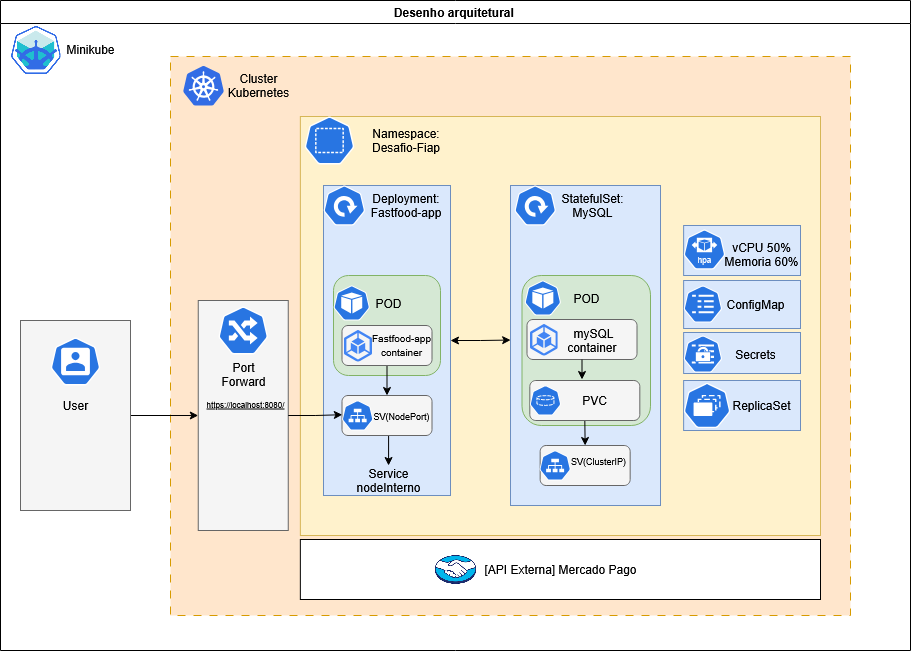
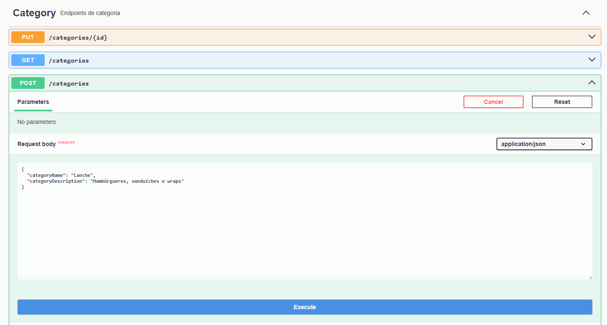
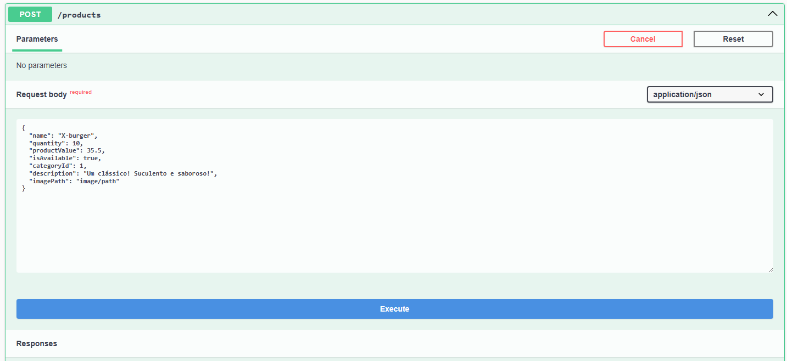
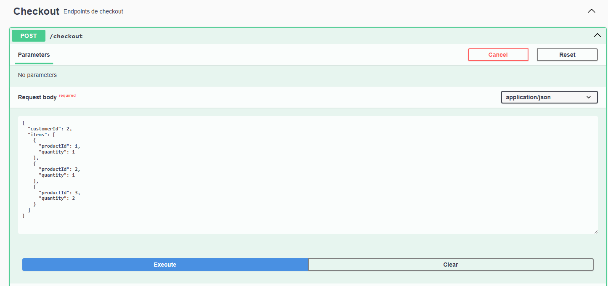
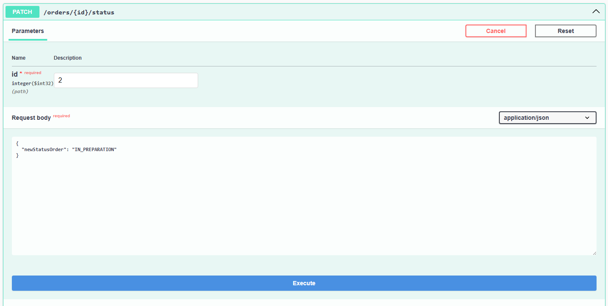

# 🍔 Tech Challenge - Fast Food
---
API REST para um sistema de pedidos de fast food, seguindo os princípios da **Clean Architecture**, com modularização por responsabilidade, promovendo manutenibilidade, escalabilidade e testabilidade.


## 🔧 Tecnologias Utilizadas

- Java 21
- Spring Boot 3
- Spring Web
- Spring Data JPA
- MySQL
- Gradle
- Docker / Docker Compose 
- Swagger (OpenAPI 3)
- kubernetes (K8s) para orquestração de containers
- DockerHub Registry para armazenamento de imagens
- CI - GitHub Actions para integração contínua

---

## 🧱 Arquitetura Clean Architecture

Este projeto utiliza a **Clean Architecture**, onde a lógica de negócio (domínio) é isolada das tecnologias externas (frameworks, banco de dados, etc). Essa separação garante baixo acoplamento e facilita a evolução do sistema.

```
       +------------------------+
       |      Controllers       | ← Entrada (Infraestrutura)
       +------------------------+
                  ↓
       +------------------------+
       |       Use Cases        | ← Regras de negócio aplicadas
       +------------------------+
                  ↓
       +------------------------+
       |       Entities         | ← Núcleo do domínio
       +------------------------+
                  ↓
       +------------------------+
       |  Gateways / Providers  | ← Interface com banco e APIs externas
       +------------------------+

```

### 📚 Padrões e Boas Práticas

- Clean Architecture
- DTO pattern
- Testes unitários com mocks
- Separação por contexto de negócio
- Uso de `@Mapper`, `@Service`, `@RestController`, `@Entity`
 


## 📁 Estrutura de Pastas

```
    src/
    ├── main/
    │ ├── java/com/fiap/fast_food_tc/
    │ │ ├── application/
    │ │ │ ├── dto/ # Objetos de transferência (Request/Response)
    │ │ │ ├── gateway/ # Interfaces (ports) para comunicação com a infraestrutura
    │ │ │ ├── service/ # Serviços de orquestração (opcional na Clean Arch)
    │ │ │ └── usecase/ # Casos de uso (interactors)
    │ │ ├── domain/
    │ │ │ ├── entity/ # Entidades do domínio
    │ │ │ ├── enums/ # Enums usados nas entidades
    │ │ │ └── exception/ # Tratamento centralizado de exceções
    │ │ ├── infrastructure/
    │ │ │ ├── client/ # Integrações com APIs externas (ex: Mercado Pago)
    │ │ │ ├── config/ # Configurações do projeto (ex: Swagger, WebClient)
    │ │ │ ├── persistence/ # Implementações dos gateways (banco de dados)
    │ │ │ │ ├── dataprovider/ # Adapters que implementam os gateways
    │ │ │ │ ├── entity/ # Entidades JPA
    │ │ │ │ └── repository/ # Repositórios JPA
    │ │ │ └── web/
    │ │ │ ├── controller/ # Controllers REST (entrada do sistema)
    │ │ │ └── mapper/ # Conversão entre DTOs e entidades
    │ │ └── FastFoodTcApplication.java # Classe principal Spring Boot
    │ └── resources/
    │ ├── application.yaml # Configuração padrão
    │ ├── application-dev.yaml # Configuração para ambiente de dev
    │ └── data.sql # Carga inicial de dados
    ├── test/
    │ ├── java/
    │ │ └── com/fiap/fast_food_tc/
    │ │ ├── unit/ # Testes unitários
    │ │ │ ├── app/ # Testes de serviços e use cases
    │ │ │ └── infra/ # Testes de controllers, mappers, providers
    │ │ └── fixture/ # Objetos de teste prontos (fixtures)
    │ └── resources/
    │ └── application-test.yaml # Configuração para testes
```


## 🧠 Mapa Visual do Projeto

Para facilitar o entendimento da arquitetura, fluxos e ideias principais do projeto, utilizamos um quadro colaborativo no Miro.

Você pode acessá-lo pelo link abaixo:

🔗 [Clique aqui para acessar o board no Miro](https://miro.com/app/board/uXjVI1j49zw=/?share_link_id=474036713451)

> **Observação**: É necessário ter acesso autorizado para visualizar o conteúdo do board. Caso não consiga visualizar, solicite permissão ao responsável pelo projeto.

---

## 📦 Funcionalidades

- 👤 Cadastro e consulta de clientes via CPF
- 🍔 CRUD de produtos com categorias
- 🧾 Listagem de categorias
- 🧾 Criação e listagem de pedidos por cliente
- 💳 Checkout com geração de link de pagamento Mercado Pago
- 🔍 Documentação interativa com Swagger

---


## ▶️ Como Executar o Projeto

### ☁️ Kubernetes (K8s) - Infraestrutura

Este projeto contém uma stack de configuração Kubernetes para deploy local (via Minikube) ou em ambiente cloud (como EKS, GKE, AKS, etc).





🔗 [Desenho do projeto via drawio](https://drive.google.com/file/d/1fRBF8-BdymOkzNprR700F8J_E9lsN0hr/view?usp=sharing)

Este diagrama descreve como os recursos do projeto são implantados e interagem dentro do cluster Kubernetes, utilizando um namespace dedicado chamado Desafio-Fiap.

### Principais componentes:

| Componente           | Tipo            | Finalidade                                         |
|----------------------|------------------|---------------------------------------------------|
| Namespace            | `desafio-fiap`   | Isolamento lógico dos recursos                    |
| API FastFood         | `Deployment`     | Executa a aplicação com escalabilidade            |
| Banco MySQL          | `StatefulSet`    | Banco de dados com volume persistente             |
| Serviço da API       | `NodePort`       | Acesso via `port-forward` para testes locais      |
| Serviço do MySQL     | `ClusterIP`      | Comunicação interna com a API                     |
| ConfigMap            | `ConfigMap`      | Configurações da aplicação e banco                |
| Segredos             | `Secret`         | Credenciais e tokens de acesso                    |
| Autoscaling          | `HPA`            | Escala a API com base em uso de CPU/memória      |
| PVC                  | `Volume`         | Persistência dos dados do MySQL                   |

---


## 🔷 Componentes Principais

### 🧭 Namespace: `desafio-fiap`
Isola todos os recursos do projeto (Pods, Services, ConfigMaps, Secrets etc.) dentro de um contexto lógico no cluster Kubernetes.


### 📦 Fastfood-app (API)
- **Tipo:** Deployment
- **Função:** Executa o container da API Java (`fastfood-app`).
- **Service:** Expõe a API internamente com um NodePort, acessível via `kubectl port-forward`.
- **Escalabilidade:** Pode ser escalado automaticamente via HPA (Horizontal Pod Autoscaler).

#### 🛠 Recursos associados:
- **ConfigMap:** configurações como URLs e propriedades da aplicação.
- **Secret:** tokens e senhas sensíveis (como o token do Mercado Pago).
- **HPA:** monitora uso de CPU (50%) e memória (60%) para escalar horizontalmente.
- **ReplicaSet:** gerenciado pelo Deployment, garante alta disponibilidade.
- **`livenessProbe`**: Verifica se o app ainda está vivo. Se falhar, o Pod é reiniciado.
- **`readinessProbe`**: Verifica se o app está pronto para receber tráfego.
- **`strategy.rollingUpdate`**: Garante atualização suave com no máximo 1 pod fora do ar e 1 pod novo sendo criado por vez.

### 🗄 MySQL (Banco de Dados)
- **Tipo:** StatefulSet
- **Função:** Executa o container do banco de dados MySQL com persistência.
- **PVC (PersistentVolumeClaim):** Garante que os dados não sejam perdidos entre reinicializações.
- **Service:** Interno (ClusterIP) para uso da API Fastfood.

#### 🛠 Recursos associados:
- **Secret:** credenciais do banco.
- **ConfigMap:** configurações do MySQL (opcional).
- **PVC:** volume persistente associado ao StatefulSet.


### 🔁 Integração Externa
A aplicação Fastfood se comunica com a API externa do Mercado Pago, utilizando o WebClient e tokens armazenados no Secret.


### 👤 Acesso do Usuário
- **Port Forward:** O usuário acessa a API via `http://localhost:<porta>` com redirecionamento temporário (`kubectl port-forward`).
- **Alternativas:**
    - Exposição via Ingress Controller
    - Service do tipo LoadBalancer (em nuvem)

---

## 🧭 Guia de como usar a aplicação

Após iniciar a aplicação, para que ela funcione corretamente, precisamos seguir algumas etapas:

1. Cadastrar as 4 categorias Lanche, Acompanhamento, Bebida e sobremesa, respectivamente. 
   - Exemplo de cadastro de categoria: 
2. Cadastrar os produtos.
   - Exemplo de cadastro de produto: 

Agora com a aplicação populada, podemos começar o fluxo de realização de pedido.
1. primeiro realizamos um pedido: (Para cliente não identificados, utilizar id 0) 

   - Resposta da requisição:
      ```json 
      {
        "orderId": 2,
        "paymentLink": "https://sandbox.mercadopago.com.br/checkout/v1/redirect?pref_id=534690741-8fea4a6d-9e9a-48e1-bd88-c30c51554862",
        "statusOrder": "PAYMENT_PENDING",
        "orderCode": 4,
        "totalAmount": 113,
        "orderRequest": {
          "customerId": 2,
          "items": [
            {
              "productId": 1,
              "quantity": 1
            },
            {
              "productId": 2,
              "quantity": 1
            },
            {
              "productId": 3,
              "quantity": 2
            }
          ]
        }
      }
      ```
2. Fazemos o pagamento desse pedido pelo sandbox do MercadoPago.
3. A cozinha atualiza status do pedido.
   

---


## 📄 Documentação da API

A documentação dos endpoints está disponível via Swagger/OpenAPI:

    Após iniciar a API, acesse: http://localhost:8080/swagger-ui.html
    (assumindo port-forward para a porta 8080)
    


### Pré-requisitos

- Docker
- Kubernetes local (Minikube ou Kind)
- `kubectl` configurado


### Passos


#### ▶️ Rodar com Minikube

```bash
# Iniciar Minikube
minikube start

# Acessar diretório de infraestrutura
cd infraestrutura/

# Aplicar todos os manifestos
chmod +x deploy.sh
./deploy.sh

# Fazer port-forward da API (ex: porta 8080)
chmod +x portforward.sh
./portforward.sh

# deletar todos os manifestos
chmod +x cleanup.sh
./cleanup.sh

# Acessar o dashboard do Minikube
Caso queira acompanhar os logs da aplicação, execute:
minikube dashboard

acessar o dashboard do Minikube e verificar os logs do pod da API, e todos os dados do cluster.
```


### Local

1. Clone o repositório e navegue até a pasta do projeto.
2. Conceda permissão de execução ao wrapper do Gradle:
   ```bash
   chmod +x gradlew
   ```
3. Execute a aplicação com o comando:
   ```bash
   ./gradlew bootRun
   ```
4. A API ficará disponível em `http://localhost:8080` e a documentação Swagger em `http://localhost:8080/swagger-ui.html`.
5. Para executar localmente deve-se inserir uma variável de ambiente:
      ```bash
   SPRING_PROFILES_ACTIVE=dev
   ```

### Docker Compose 🐳

1. Certifique‑se de ter Docker e Docker Compose instalados.
2. Rode o comando:
   ```bash
   docker compose up --build
   ```
3. A aplicação será iniciada juntamente com um container MySQL.
4. Acesse a aplicação em `http://localhost:8080` e a documentação Swagger em `http://localhost:8080/swagger-ui/index.html`.

📚 Principais Endpoints

| Resource   | Method | Route                             | Description                        |
| ---------- | ------ |-----------------------------------|------------------------------------|
| Customer   | POST   | `/customerPersistenceEntities`                      | Register new customerPersistenceEntity              |
| Customer   | GET    | `/customerPersistenceEntities/{documentNumber}`     | Get customerPersistenceEntity by CPF                |
| Product    | POST   | `/products`                       | Register new productPersistenceEntity               |
| Product    | GET    | `/products`                       | List all products                  |
| Product    | GET    | `/products/categoryPersistenceEntity/{categoryId}` | List all products by categoryPersistenceEntity      |
| Product    | PUT    | `/products/{id}`                  | Update productPersistenceEntity                     |
| Product    | DELETE | `/products/{id}`                  | Remove productPersistenceEntity                     |
| Category   | GET    | `/categories`                     | List categories                    |
| Order      | POST   | `/ordersPersistenceEntity`                         | Create new order                   |
| Checkout   | POST   | `/checkout`                       | Generate Mercado Pago paymentPersistenceEntity link |

💳 Integração com Mercado Pago

A funcionalidade de checkout utiliza uma chamada rest para a API do Mercado Pago para gerar links de pagamento baseados no valor total do pedido. O cliente é redirecionado para a plataforma externa para finalizar a compra de forma segura.

## Testes 🧪

Os testes podem ser executados com:
```bash
./gradlew test
```
Caso esteja utilizando Docker, é possível rodar os testes dentro do próprio container.

## Configurações ⚙️

As credenciais do banco e do Mercado Pago podem ser alteradas em `src/main/resources/application.yaml`.


## 🗄️ Banco de Dados (MySQL)

### 📦 Estrutura do Banco de Dados (MySQL)

O banco de dados foi estruturado para suportar um sistema de pedidos de fast food, contemplando informações sobre produtos, categorias, clientes, pedidos, pagamentos, funcionários e itens dos pedidos. Abaixo estão as principais tabelas e seus relacionamentos:

### 🔗 Relacionamentos Principais

- Um **cliente** pode realizar vários **pedidos**.
- Um **pedido** pode conter múltiplos **produtos** (tabela intermediária `order_product`).
- Cada **produto** pertence a uma **categoria**.
- Um **pedido** pode ter um ou mais **pagamentos** associados.
- **Funcionários** são armazenados separadamente para controle administrativo.

### 🗃️ Tabelas e Campos

#### `customerPersistenceEntity`
- `customer_id` (PK)
- `document_number`
- `email`
- `first_name`
- `last_name`

#### `ordersPersistenceEntity`
- `order_id` (PK)
- `order_code`
- `order_datetime`
- `status_order`
- `total_amount`
- `customer_id` (FK → customerPersistenceEntity)

#### `order_product`
- `order_id` (FK → ordersPersistenceEntity)
- `product_id` (FK → productPersistenceEntity)
- `product_quantity`
- `product_total_amount`

#### `productPersistenceEntity`
- `product_id` (PK)
- `name`
- `description`
- `image_path`
- `available_indicator`
- `product_value`
- `quantity`
- `category_id` (FK → categoryPersistenceEntity)

#### `categoryPersistenceEntity`
- `category_id` (PK)
- `category_name`
- `category_description`

#### `paymentPersistenceEntity`
- `payment_id` (PK)
- `created_at`
- `customer_id` (FK → customerPersistenceEntity)
- `mercado_pago_id`
- `payment_method`
- `payment_status`
- `payment_value`
- `order_id` (FK → ordersPersistenceEntity)

#### `employee`
- `employee_id` (PK)
- `document_number`
- `manager_indicator`
- `name`
- `password`

---

### ✅ Inserts de Exemplo

```sql
-- Categorias
INSERT INTO categoryPersistenceEntity (category_name, category_description) VALUES 
('Lanches', 'Hambúrgueres, sanduíches e wraps'),
('Bebidas', 'Refrigerantes, sucos e água'),
('Sobremesas', 'Doces e sobremesas variadas');

-- Produtos
INSERT INTO productPersistenceEntity (name, description, product_value, quantity, category_id) VALUES 
('Hambúrguer Clássico', 'Pão, carne, queijo e salada', 18.90, 50, 1),
('Cheeseburger Duplo', 'Dois hambúrgueres e queijo extra', 24.90, 40, 1),
('Refrigerante Lata', '350ml - diversos sabores', 5.00, 100, 2),
('Água Mineral', '500ml sem gás', 3.00, 120, 2),
('Sorvete de Chocolate', '1 bola de sorvete artesanal', 7.00, 30, 3);

-- Clientes
INSERT INTO customerPersistenceEntity (document_number, email, first_name, last_name) VALUES
('12345678900', 'ana@email.com', 'Ana', 'Silva'),
('98765432100', 'bruno@email.com', 'Bruno', 'Oliveira');

-- Pedidos
INSERT INTO ordersPersistenceEntity (order_code, status_order, total_amount, customer_id) VALUES
('ORD001', 'Finalizado', 48.80, 1),
('ORD002', 'Pendente', 32.90, 2);

-- Itens do pedido
INSERT INTO order_product (order_id, product_id, product_quantity, product_total_amount) VALUES
(1, 1, 1, 18.90),
(1, 2, 1, 24.90),
(1, 3, 1, 5.00),
(2, 2, 1, 24.90),
(2, 4, 1, 3.00),
(2, 5, 1, 5.00);

-- Pagamentos
INSERT INTO paymentPersistenceEntity (customer_id, mercado_pago_id, payment_method, payment_status, payment_value, order_id) VALUES
(1, 'MP123ABC', 'Cartão de Crédito', 'Aprovado', 48.80, 1),
(2, 'MP456DEF', 'Pix', 'Pendente', 32.90, 2);

-- Funcionários
INSERT INTO employee (document_number, manager_indicator, name, password) VALUES
('00011122233', TRUE, 'Carlos Gerente', 'hash_da_senha'),
('00044455566', FALSE, 'Fernanda Atendente', 'hash_da_senha');
```

---

### 🔍 Views Úteis

#### 1. Total gasto por cliente

```sql
CREATE VIEW vw_total_por_cliente AS
SELECT 
    c.customer_id,
    CONCAT(c.first_name, ' ', c.last_name) AS cliente,
    SUM(o.total_amount) AS total_gasto
FROM ordersPersistenceEntity o
JOIN customerPersistenceEntity c ON c.customer_id = o.customer_id
GROUP BY c.customer_id;
```

#### 2. Faturamento por categoria

```sql
CREATE VIEW vw_faturamento_categoria AS
SELECT 
    cat.category_name,
    SUM(op.product_total_amount) AS total_vendido
FROM order_product op
JOIN productPersistenceEntity p ON p.product_id = op.product_id
JOIN categoryPersistenceEntity cat ON cat.category_id = p.category_id
GROUP BY cat.category_name;
```

#### 3. Produtos mais vendidos

```sql
CREATE VIEW vw_produtos_mais_vendidos AS
SELECT 
    p.name AS produto,
    SUM(op.product_quantity) AS total_vendido
FROM order_product op
JOIN productPersistenceEntity p ON p.product_id = op.product_id
GROUP BY p.name
ORDER BY total_vendido DESC;
```


## Feito por Gustavo Jesus, Leonardo Fujimura e Pedro Peçanha.
